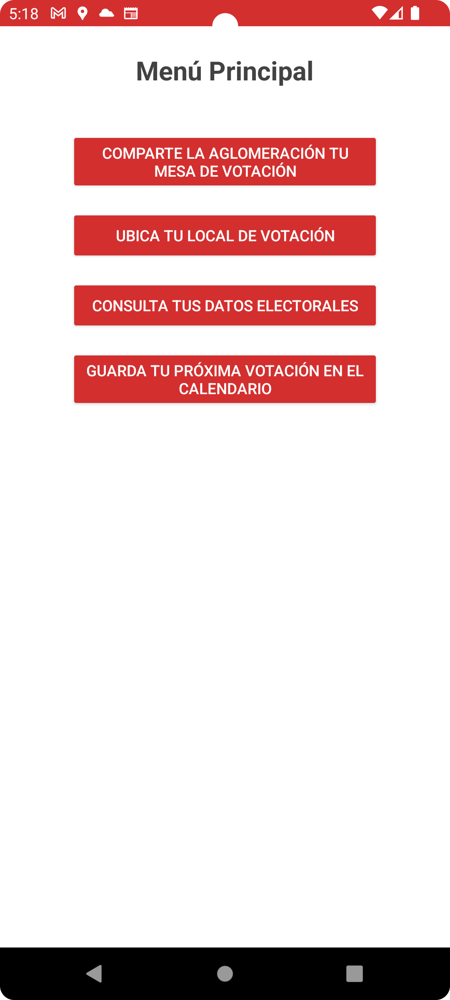
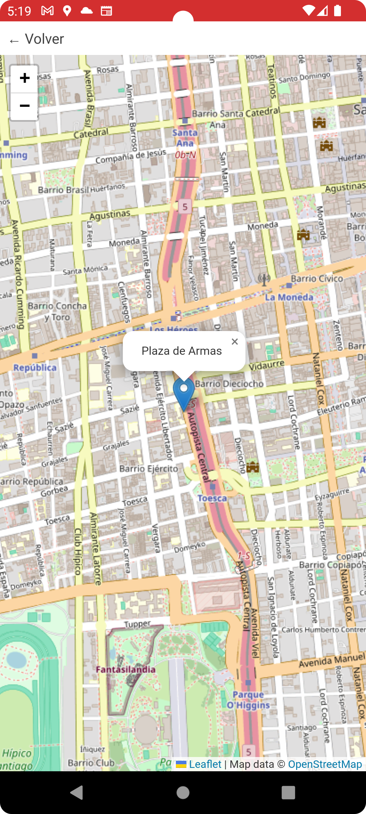
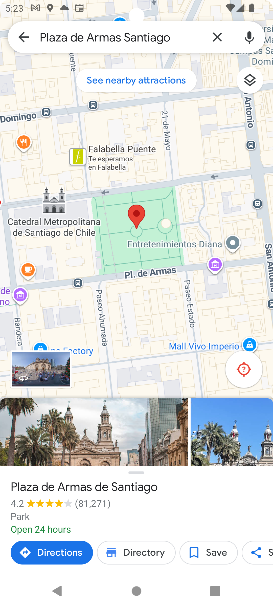
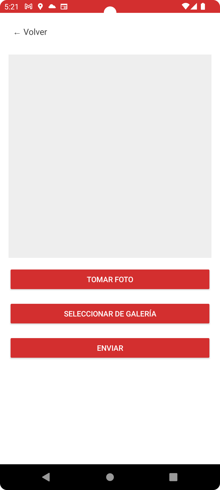

# ServelApp

## Resumen del proyecto
Aplicación Android para visualizar información de Servel:
- Abrir cámara y tomar foto 📸
- Abrir mapas con Google Maps o WebView
- Consultar web de Servel 🗳️
- Agregar evento al calendario 📆

**Versión Android/AGP:** Android 13, AGP 8.1.1

---

## Intents implementados

### Implícitos (5) ✨
1. Abrir Google Maps (geo URI) → Click corto en btnMapa
2. Abrir navegador web → btnServel
3. Tomar foto con cámara → btnFoto (ACTION_IMAGE_CAPTURE)
4. Abrir calendario → btnCalendario (ACTION_INSERT)
5. Seleccionar imagen de galería → Trae una imagen desde la galería a la aplicación por una uri

### Explícitos (3)✨
1. Abrir PhotoActivity → btnFoto
2. Abrir MapActivity (WebView interno) → click largo btnMapa
3. Abrir MapActivity -> click corto btnMapa deriva a una coordenada en específico.

**Pasos de prueba:** 📄
1. Abrir app, presionar btnMapa corto → se abre Google Maps
2. Presionar btnMapa largo → se abre MapActivity
3. Presionar btnFoto → abre PhotoActivity y toma foto
4. Presionar btnServel → abre navegador con web de Servel
5. Presionar btnCalendario → agrega evento al calendario

---

## Capturas de pantalla 📱

### MenuActivity

### MapActivity (WebView)

### Google Maps externo

### PhotoActivity

